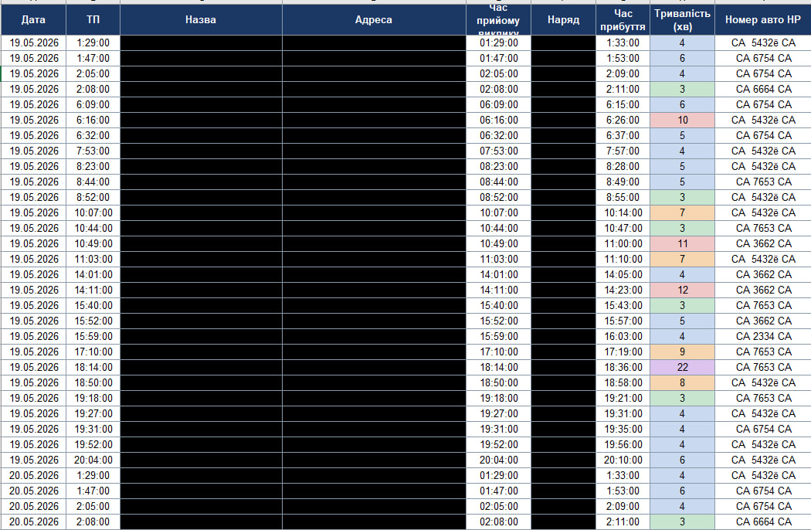

# UPOTIMEDRIVER

Десктоп-застосунок для автоматичної обробки файлів пожежних виїздів УПО.
Об'єднує добові вигрузки з бази, підставляє номери автомобілів,
рахує тривалість прибуття та формує чистий Excel-звіт з кольоровим маркуванням
часу прибуття.

<p align="center">
  
</p>

---

## Можливості

- 📅 **Колонка з датою** — береться з назви аркуша (`19.05.2026`, `20.05.2026` …) і пишеться першою колонкою у звіті
- 🔀 **Об'єднання двох файлів** — спочатку всі записи за 19.05 хронологічно, потім всі за 20.05
- 🧹 **Чистка зайвого** — видаляються службові колонки, дублікати, рядки без часу / наряду / адреси
- 🚓 **Автопідстановка номерів авто** за підрозділами (`НР 10 / 12 / 13 / 15 / Умань 1 / Умань 2`)
- ⏱ **Формула тривалості** `=MINUTE(G−E)` — Excel перераховує хвилини прибуття самостійно
- 🎨 **Кольорова заливка комірки тривалості** — пастельні відтінки в тон карток статистики:

  | Інтервал | Заливка | Опис |
  |---|---|---|
  | ≤ 3 хв | `#C8E6CF` 🟢 | світло-зелений |
  | 3 – 6 хв | `#C9D9F0` 🔵 | світло-синій |
  | 6 – 9 хв | `#F5D6B0` 🟠 | світло-оранжевий |
  | 9 – 15 хв | `#F0C8C8` 🔴 | світло-червоний |
  | > 15 хв | `#DCC4EE` 🟣 | світло-фіолетовий |

- 📊 **Статистика прибуття у вікні застосунку** — 5 кольорових карток + загальна сума, оновлюється одразу як завантажуєш файл
- 📈 **Файл «Готовий»** — третій пікер, показує статистику з уже сформованого xlsx (без перетворень)
- 📋 **Кнопка «Переглянути готовий файл»** — відкриває будь-який сформований xlsx у дефолтному Excel для перегляду / корегування
- ☑ **Чекбокс + ✕** біля кожного файлу — увімкнути/вимкнути обробку чи одним кліком очистити поле
- 💾 **Збереження конфігу** в `%APPDATA%\UPOTIMEDRIVER\upo_config.json` — номери авто не губляться між запусками

---

## Приклад вихідного файлу

Колонка «Тривалість (хв)» розфарбовується автоматично:

<p align="center">
  
</p>

---

## Запуск

### Готовий exe (рекомендовано)
Завантажити `UPOTIMEDRIVER.exe` зі сторінки [Releases](https://github.com/OleksanderZabila/upo-scripts/releases) (або зібрати з джерел — нижче) і запустити.
Жодних залежностей не треба.

### З Python
```bash
pip install customtkinter openpyxl pandas Pillow
python УПО_Scripts.py
```

### Зібрати exe самостійно
```bash
pip install pyinstaller
pyinstaller --onefile --windowed ^
  --name "UPOTIMEDRIVER" ^
  --icon "patrol-polycar.ico" ^
  --add-data "upo_emblem.png;." ^
  --add-data "patrol-polycar.ico;." ^
  --add-data "patrol-polycar.png;." ^
  "УПО_Scripts.py"
```
Готовий `UPOTIMEDRIVER.exe` з'явиться в `dist/`.

---

## Налаштування номерів авто

1. Натиснути **⚙ Змінити** на картці «Номери автомобілів»
2. Ввести держномер для кожного підрозділу
3. **Зберегти** — конфіг запишеться в `%APPDATA%\UPOTIMEDRIVER\upo_config.json`

При наступних запусках номери підтягнуться автоматично.

---

## Структура вихідного Excel

| # | Колонка | Джерело |
|---|---------|---------|
| 1 | Дата | Назва аркуша вхідного файлу |
| 2 | ТП | Колонка B (час прийому) |
| 3 | Назва | Колонка C |
| 4 | Адреса | Колонка D |
| 5 | Час прийому виклику | Колонка E вхідного файлу |
| 6 | Наряд | Колонка F |
| 7 | Час прибуття | Колонка G вхідного файлу |
| 8 | Тривалість (хв) | `=MINUTE(G − E)` — з кольоровою заливкою |
| 9 | Номер авто НР | з конфігу за підрозділом |

Файл зберігається поруч із першим вхідним: `УПО_DD.MM.YYYY.xlsx` (якщо вже існує — додає суфікс `_1`, `_2`, …).

---

## Файли проєкту

| Файл | Призначення |
|------|-------------|
| `УПО_Scripts.py` | Головний GUI-застосунок |
| `convert_1905.py` | CLI-версія конвертера (без вікна) |
| `upo_emblem.png` | Емблема УПО для шапки |
| `Security_Police_of_Ukraine_emblem.svg` | Оригінал емблеми (SVG) |
| `patrol-polycar.ico` / `.png` | Іконка / зображення для шапки |
| `app.jpg` | Скріншот інтерфейсу |
| `output.jpg` | Скріншот вихідного файлу з кольорами |

---

## Історія версій

**v3.0** — фінальний правильний маппінг: col E ← input E (05:44), col G ← input G (05:47), тривалість = G − E (хвилини прибуття).

**v2.8** — рядки з битим/порожнім часом більше не викидаються: лишаються у звіті з порожніми комірками часу та порожньою тривалістю (`=IFERROR(...,"")`), щоб оператор міг побачити та допильнувати запис вручну. Відкидаються тільки рядки без адреси або наряду.

**v2.7** — окремий блок для «Готового» файлу з жирним жовтим підписом «ⓘ Готовий файл — лише перегляд статистики»; розділювач між вхідними та готовим файлом.

**v2.6** — третій файл-пікер «Готовий» для перегляду статистики готового xlsx; кольорова заливка комірки тривалості за інтервалом; колонку 7 перейменовано «Час відбуття» → «Час прибуття», бере з вхідної колонки G.

**v2.5** — ✕ для очищення файлів; кнопка «Переглянути готовий файл» (open in Excel).

**v2.4** — перейменування на UPOTIMEDRIVER, емблема в шапці, футер з версією та посиланням на GitHub, оновлений дизайн.

---

## Автор

Олександр Забіла — [github.com/OleksanderZabila](https://github.com/OleksanderZabila)
