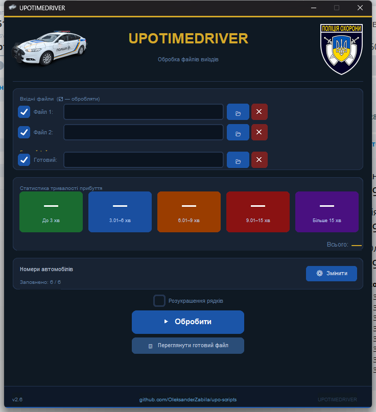

# UPOTIMEDRIVER

Десктоп-застосунок для автоматичної обробки файлів виїздів УПО.
Об'єднує добові вигрузки з бази, підставляє номери автомобілів,
рахує час прибуття та формує чистий Excel-звіт.



---

## Можливості

- 📅 **Колонка з датою** — береться з назви аркуша (`19.05`, `20.05` …) і пишеться першою колонкою у звіті
- 🔀 **Об'єднання двох файлів** — спочатку всі записи з 19.05 хронологічно, потім всі з 20.05
- 🧹 **Чистка зайвого** — видаляються службові колонки, дублікати, рядки без часу/наряду/адреси
- 🚓 **Автопідстановка номерів авто** для підрозділів НР 10 / 12 / 13 / 15 / Умань 1 / Умань 2
- ⏱ **Формула тривалості** `=MINUTE(G−E)` — Excel рахує хвилини прибуття самостійно
- 🎨 **Кольорова заливка тривалості** — комірка фарбується пастельним відтінком у тон карток (зелений ≤3, синій 3-6, оранжевий 6-9, червоний 9-15, фіолетовий >15)
- 📊 **Статистика прибуття** в реальному часі — 5 кольорових карток + загальна сума
- 📋 **Перегляд готового файлу** — окрема кнопка відкриває будь-який сформований xlsx в Excel
- 📈 **Файл «Готовий»** — третій файл-пікер, показує статистику з уже сформованого файлу (без перетворень)
- ☑ **Чекбокси + ✕** біля кожного файлу — обробити чи ні, або одним кліком очистити
- 💾 **Збереження конфігу** в `%APPDATA%\UPOTIMEDRIVER\upo_config.json` — номери авто не губляться між запусками

---

## Запуск

### Готовий exe (рекомендовано)
Завантажити `UPOTIMEDRIVER.exe` зі сторінки [Releases](https://github.com/OleksanderZabila/upo-scripts/releases) (або зібрати з джерел — нижче) і запустити.
Жодних залежностей не треба.

### З Python
```bash
pip install customtkinter openpyxl pandas Pillow
python УПО_Scripts.py
```

### Зібрати exe самостійно
```bash
pip install pyinstaller
pyinstaller --onefile --windowed ^
  --name "UPOTIMEDRIVER" ^
  --icon "patrol-polycar.ico" ^
  --add-data "upo_emblem.png;." ^
  --add-data "patrol-polycar.ico;." ^
  --add-data "patrol-polycar.png;." ^
  "УПО_Scripts.py"
```
Готовий `UPOTIMEDRIVER.exe` з'явиться в `dist/`.

---

## Налаштування номерів авто

1. Натиснути **⚙ Змінити** на картці «Номери автомобілів»
2. Ввести держномер для кожного підрозділу
3. **Зберегти** — конфіг запишеться в `%APPDATA%\UPOTIMEDRIVER\upo_config.json`

При наступних запусках номери підтягнуться автоматично.

---

## Структура вихідного Excel

| # | Колонка | Джерело |
|---|---------|---------|
| 1 | Дата | Назва аркуша вхідного файлу |
| 2 | ТП (час прийому) | Колонка B |
| 3 | Назва | Колонка C |
| 4 | Адреса | Колонка D |
| 5 | Час прийому виклику | Колонка B (формат `HH:MM:SS`) |
| 6 | Наряд | Колонка F |
| 7 | **Час прибуття** | Колонка G |
| 8 | Тривалість (хв) | `=MINUTE(G − E)` — прибуття − прийом, **з кольоровою заливкою за інтервалом** |
| 9 | Номер авто НР | з конфігу за підрозділом |

Колонка `Тривалість (хв)` зафарбовується пастельними відтінками в тон карток статистики:
🟢 до 3 хв • 🔵 3–6 • 🟠 6–9 • 🔴 9–15 • 🟣 більше 15.

Файл зберігається поруч із першим вхідним: `УПО_DD.MM.YYYY.xlsx`.

---

## Файли проєкту

| Файл | Призначення |
|------|-------------|
| `УПО_Scripts.py` | Головний GUI-застосунок |
| `convert_1905.py` | CLI-версія конвертера (без вікна) |
| `upo_emblem.png` | Емблема УПО для шапки |
| `Security_Police_of_Ukraine_emblem.svg` | Оригінал емблеми (SVG) |
| `patrol-polycar.ico` / `.png` | Іконка / зображення для шапки |
| `screenshot.png` | Скріншот інтерфейсу |

---

## Версія

**v2.6** — третій файл-пікер «Готовий» для перегляду статистики готового xlsx; кольорова заливка комірки тривалості за інтервалом; колонку 7 перейменовано «Час відбуття» → «Час прибуття», бере з вхідної колонки G.

**v2.5** — ✕ для очищення файлів; кнопка «Переглянути готовий файл» (open in Excel).

**v2.4** — перейменування на UPOTIMEDRIVER, емблема в шапці, футер з версією та посиланням на GitHub, оновлений дизайн.

## Автор

Олександр Забіла — [github.com/OleksanderZabila](https://github.com/OleksanderZabila)
